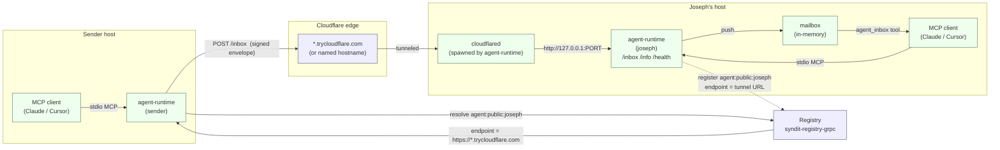
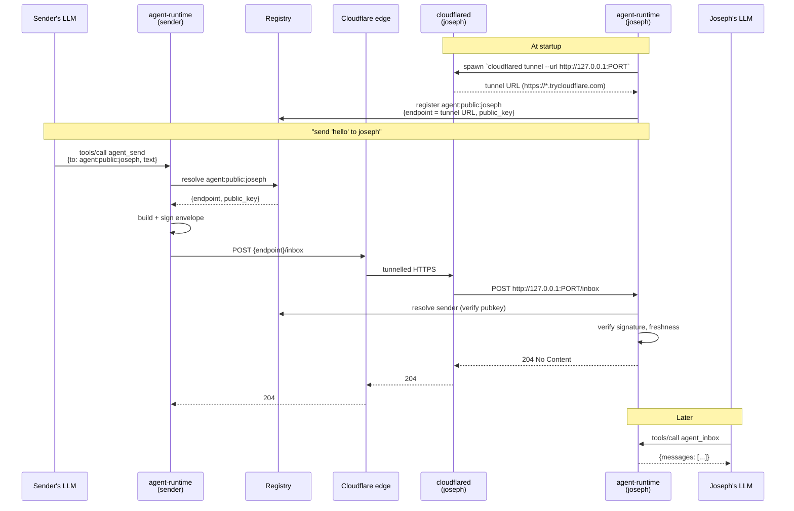

# Syndit network

How a message gets from one agent to another across the network.

## Topology

## Message flow: "send a message to joseph"

## Postures

| Posture  | Bind          | Advertise   | Reachable from           | Notes |
| -------- | ------------- | ----------- | ------------------------ | ----- |
| local    | `127.0.0.1:0` | `localhost` | Same machine             | Default |
| lan      | `0.0.0.0:0`   | `lan`       | Same network             | Uses first non-loopback IPv4 |
| private  | `0.0.0.0:0`   | `tunnel`    | Anywhere (invite-gated*) | *Invitation gating is future work — today behaves like `public` |
| public   | `0.0.0.0:0`   | `tunnel`    | Anywhere                 | Spawns `cloudflared` |

For `public` / `private`, `agent-runtime` spawns `cloudflared` and registers the resulting URL with the registry as the agent's endpoint. By default this is a Cloudflare "quick tunnel" — no Cloudflare account needed, but the URL is ephemeral and changes on every restart. Pass `--tunnel-hostname` + `--tunnel-token` (or set `CLOUDFLARE_TUNNEL_HOSTNAME` + `CLOUDFLARE_TUNNEL_TOKEN`) to use a named tunnel with a stable URL.

## Components

- **Registry** (`syndit-registry-grpc`) — directory mapping `agent:<posture>:<name>` to `{endpoint, public_key}`. Remote, hosted.
- **agent-runtime** — local process per agent. Two surfaces:
  - **stdio MCP server** for the LLM client (`agent_status`, `agent_list`, `agent_send`, `agent_inbox`).
  - **HTTP inbound** server on `bind` (`/inbox`, `/info`, `/health`) for receiving envelopes from other agents.
- **cloudflared** — Cloudflare's tunnel daemon, spawned as a child of `agent-runtime` when posture is `public`/`private`. Terminates the public HTTPS endpoint and proxies to the local HTTP inbound server.
- **MCP client** — Claude Code or Cursor; launches `agent-runtime` over stdio per its MCP configuration.

## Trust model

- Every envelope is signed with the sender's Ed25519 key. The receiver fetches the sender's public key from the registry and verifies the signature before accepting.
- Envelopes carry an `issued_at` timestamp and a freshness window; replays outside the window are rejected.
- The tunnel adds transport confidentiality (TLS to Cloudflare edge), but the application-layer signature is what authorises delivery — Cloudflare is not in the trust path for content.
